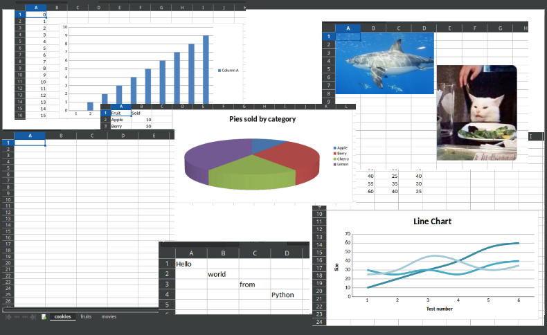

# Excel with Python

**Author:** Steve Pinilla Jurado

**Instructor:** Frank Anemaet

**Certificate:** [Link](./Certificado_SteveJurado.pdf)

**Last Update:** Feb 24/2023

***

I took this course on the [Udemy platform](https://www.udemy.com/). The **aim** of this course was to learn how to use Python for reading and writing Excel spreadsheets using the [`openpyxl`](https://openpyxl.readthedocs.io/en/stable/) library.

